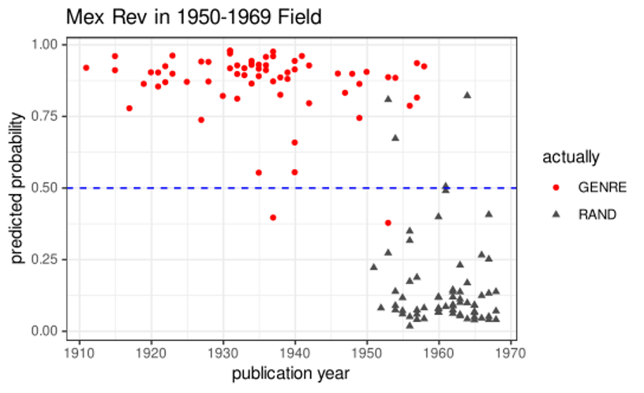
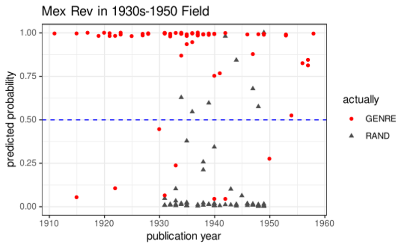

# Final Report: Period-Specific Worksets for Spanish American Fiction

José Eduardo González  
[jgonzalez2@unl.edu](jgonzalez2@unl.edu)  
ORCID number: 0000-0002-8899-3021  
Universidad de Nebraska-Lincoln 

## Introduction
As Digital Humanities scholars began to employ quantitative approaches (using, for example, bag-of-words techniques or Machine Learning models) to identify literary genres and sub-genres, their efforts were logically applied to popular modes with formulaic structures, such as detective fiction and science fiction and other styles that have a long history and are popular in the international book market. Many of the results obtained are extremely accurate at detecting when a text belongs to a specific genre. This project originated in my interest to apply techniques that have been successful in the study of genres in English to a corpus composed of literary texts from Spanish America. Initially, I had reasons to think that the Spanish American literary tradition might present an interesting challenge to these techniques. While those genres on which Digital Humanities scholarship was focused were based on well-known formulas and topics attractive to book readers worldwide, the genres I was thinking about possessed a more limited audience as they were born as a textual reaction to national or regional historical events in Spanish America. For example, one of the most important (and commercially successful) genres in the history of Mexican literature was a narrative retelling of events that took place as a result of the revolution against the dictatorship of Porfirio Díaz between 1911 and 1921. This type of narration became known as the “novel” of the Mexican Revolution. On the one hand, when compared to the detective novel or the science fiction story, the novels of the Mexican revolution appear to be a loose grouping of literary texts with only a few similarities in terms of plot lines among them. On the other hand, the fact that a nation’s history is embedded in a literary genre, raises a set of other issues that are not problematic when studying the universal characteristics of the detective fiction. Neither nationality nor language are issues normally addressed in quantitative studies of literary genres. Translations of detective fiction are apparently as likely to be recognized as such as those written in English. 

Other Spanish American genres similar genres to the novel of the Mexican revolution (because their main characteristic is the description on an event or series of events) are the novel of “La Violencia” which focuses on depicting how partisan politics in Colombia degenerated into a long period of military violence and armed struggle between 1946 and 1965, and Narconarrative, which are stories revolving around the situations created by the impact of narcotrafficking. Slightly different, but still linked to social aspects of the region, is the Indigenismo genre, whose prose seeks to protest the living condition of contemporary indigenous populations in Spanish America. Finally, while not exactly a genre but an epochal style, I included modernismo, a turn-of-the century movement whose most representative works possessed an exotic, finely wrought prose. These genres or styles are described in more detail in the Introduction to the datasets created for this project.

## Data and Methodology
For my data I have used the volumes available through the HathiTrust library. Using as reference academic articles on the subjects as well as histories of literature, I created lists of titles and they became the basis for datasets created with the help of the HathiTrust staff. For some genres a high number of the texts were available. I am building my models with 66 novels of the Mexican revolution, 82 indigenista novels, 80 novels of “Violencia,” and 343 volumes of “modernista” fiction. The smallest set was “narconarrative” with only 47 samples and its reduced size can be explained as a result of many of these novels being of recent publication or having been published in small runs for local markets. Each ML model is created balancing the volumes for one genre with a random selection of texts from other genres and/or random volumes not belonging to any of the classified genres. A series of “unsorted” datasets that were created as part of the project became invaluable for this aspect of the investigation (see González, “[Introduction](introduction.md)”). They will also be essential for taking this study into new directions. The Unsorted sets include all the novels I could find in the HathiTrust library for every South American country and they have not been assigned any label regarding their style or genre. 

I use a logistic regression model with hyperparameters adjusted using a 10 k-fold CV process. To avoid the style of an author interfering with the accuracy of the model the random class never includes any volume from an author who is already part of the genre class. I also experimented with the LOOCV (Leave-One-Out Cross-Validation) method employed by Ted Underwood in his an articles and books. In this approach a model is built from all the volumes in the set except one and the resulting model is the applied to the excluded volume. My models use approximately 5000 features/words[^1]  determined by document frequency, which means that it employs the top tokens shared by the volumes in the set used when creating the model. A long list of (over 700) Spanish stopwords eliminates the most common tokens. In “The Life Cycles of Genres,” Underwood argues that one should consider “a genre predicted with only 76% accuracy as a ‘relatively loose’ grouping, compared to one that can be recognized 91% of the time” and even though he quickly explains that even those models with around 76% “ reveal substantial similarities across a group of texts,” I decided to employ that percentage as the dividing line above which a collection of literary texts can be declared a genre.

|    |    | Mexican Revolution | Indigenismo| Violencia novel| Narconarrative| Modernismo
| :--| :--| :--------------- | :----------| :--------------| :-------------| :---------|
|    | No. of vols in genre | 66   | 82     | 80            | 47           | 343       |
| Model 1 | Accuracy | 0.925 | 0.863        | 0.875             | 0.96           | 0.83   |
| Model 2 | Accuracy | 0.9 | 0.818        | 0.895             | 1           | 0.86      |
| Model 3 | Accuracy | 0.925    | 0.954         | 0.791       | 0.93     | 0.82    |
| Model 4 | Accuracy | 0.85    | 0.954         | 0.916       | 0.86          | 0.84      |
| Model 5 | Accuracy | 0.87   | 0.863      | 0.937             | 0.966           | 0.83      |
|  | Average accuracy | 89.4% | 89.04% | 88.28% | 94.32% | 83.6% |

_Table 1: ML models for five Spanish American genres_

## Results
While I approached this investigation with skepticism about the capacity of ML models to recognize some of these Spanish American groups of texts as a genre, my initial observations were that all of them easily passed the 76% accuracy test (See Table 1). This was an impressive result not only for the Mexican revolution “novel,” which includes a combination of diverse types of narrative modes, but also for multi-national genres, such as indigenismo. It was also surprising that the genre with the highest rate of accuracy was the narconarrative novel. Narconarrative is the youngest literary genre in Spanish American literature and it has become very popular in the 21st century. Before creating the models, I assumed that because of the violence that is part of the narco culture described in these novels it would be difficult to distinguish narconarratives from two other genres in the random set that focus on violence (novel of the Mexican Rev and Violencia novel), but using those two genres as part of the random set did not affect greatly in any way the effectiveness of narconarrative models. A possible explanation for the great perfomance of this model is suggested below. 

In the case of indigenismo while many of the terms that appear in those texts include words from native American languages in Latin America, this had no effect on the model most likely because of the emphasis on document frequency as opposed to token frequency. Finally, a style that was very popular during the early part of the 20th century literary field all over the  region, modernismo showed good accuracy in most tests. Modernismo was complicated phenomenon and there are several variants and stages into which it can be divided. A careful study focusing on those distinctions would be worthwhile. Because both indigenismo and modernismo were multinational styles, at first I considered these results a pretty conclusive demonstration that national origin was of little relevance for applying ML to the study of genres. However, the issue of national origin moved again to a central place in my investigation as I began to look into the composition of the random sets.

## Random Sets
The binomial logistic regression models I am creating need two classes or labels, the genre label which includes the volumes identified as belonging to a literary genre and a random label with volumes that are not part of the genre. As I am using the “accuracy” metric to determine the success or failure of the models, the inclusion of random volumes that possess features similar to those in the genre label will likely cause the model to perform poorly. In contrast to the model created using a completely random set for Table 1, I created two other using random sets of a different composition. For the first experiment, the random set was selected from a group composed of volumes belonging to all the other genres in the project (“modernismo”, “indigenismo”, “narconarrative”, “Violencia” novel). For the second experiment the random set came from a group of 700 Mexican novels published between the 1861 and 1969. Each model was composed of the 66 novels of the revolution and 66 volumes randomly selected from the random set.

|      | With a completely (unlabeled) random set | With random set made up of other genres | With random set from Mexican literature |
| :----------------- | :------------------- | :---------------------- | :------- |
| Accuracy           | 0.925                | 0.9                     | 0.75     |
| Accuracy           | 0.9                  | 0.925                   | 0.775    |
| Accuracy           | 0.925                | 0.925                   | 0.725    | 
| Accuracy           | 0.85                 | 0.9                     | 0.725    |
| Accuracy           | 0.87                 | 0.9                     | 0.675    |
| Average Accuracy   | 89.4%                | 91%                     | 71%      |

_Table 2: Models for the novel of the Mexican revolution using three different types of random sets_

The results (Table 2) might not look significantly different from previous ones in terms of the effectiveness of the model. The rationale for using other genres as the source of the random set was to see if including texts that I already knew were not novels of the Mexican revolution produced a higher number of correct predictions than a totally random (and unlabeled) set. Accuracy did go up, but only slightly. The results from using the third random set, composed of volumes of Mexican literature from different periods, were more interesting as the accuracy of the models created with that data were significantly lower than the other two and often was unable to reach 76%. From a technical standpoint, on the hand, the best way to understand this change is as the introduction of noise in the data used to create a model. Noisy labels in supervised learning are usually the result of misclassification or corruption of the data. While human error can often be the cause of mistakes in assigning labels, a problem more difficult to address is when annotating data requires domain expertise. For the sake of simplicity, let us say for the moment that in literary studies we also depend on experts who decide whether a work of literature belongs to a genre or another. Is this what is happening when I use a set of Mexican novels as random labels for my model of the revolutionary novel model? Does my data contain wrongly assigned labels? From the point of view of the literary historian, on the other hand, the possibility that a machine learning model fails, that it gives the wrong predictions, because of noisy labels found in a national context suggests the possibility of studying genres in relation to the dominant lexicon in a national literary field at a specific moment in time. 

## A Case Study: the novel of the Mexican revolution.
As mentioned above, the novels of the Mexican revolution depict the events of the 1910-20 conflict and its consequences. Mariano Azuela’s Los de abajo (The Underdogs, 1915) is considered the be the starting point of this genre and, like a few other texts in the group, was supposedly written as the historical events being described in it were taking place. Azuela’s early work, however, went unnoticed as the genre did not gain popularity until several years later. In a well-known 1925 polemic, refuting the idea that there was no Mexican literature reflecting the local turbulent reality of their time, Francisco Monterde (1894–1985) brought to the attention of the public the “virile” qualities of Azuela’s work and his portrayal of the revolutionary conflict (Ruffinelli 232). As the genre gained popularity, a small conflict ensued within the early 20th century local literary market pitting books using expensive (for the post-revolutionary society) paper and focusing on colonialista literature (works depicting in a idealized fashion the colonial period) and on foreign-influenced fiction against the inexpensive, newspaper-backed novels about national topics. During the next decade and a half the novel of the Mexican Revolution would dominate the local publishing market. It helped that since the years immediately preceding the revolution a strong nationalistic discourse appeared (expressed mainly through the same newspapers where many of these novels were initially published in installments) which favored the use of Mexican themes and a journalistic approach to fiction (Torres 177-76).  The nationalist tendencies in fiction—as it did in the plastic arts—would have a long lasting effect on the Mexican letters. 

The status of the novel of the Mexican revolution as a genre has been often questioned, mainly because within this group of works one can find some that are not actually novels but biographies, autobiographies, testimonial accounts, and compilations of loosely connected stories. In recent years, some scholars have begun replacing the term “novel” with the more ambiguous “narration” and/or “narrative,” thus putting in doubt their group identity and suggesting that the connections among these texts is looser than it was previously believed. While the common topic of revolutionary uprising has been from the beginning the main aspect justifying the group’s identity, other characteristics have been advanced as distinguishing features such as the tendency to combine literature with politics, history and sociology (Chang 527). One of the many insights of Torres de la Rosa’s Avatares editoriales de un “género” (Editorial Journey of a “Genre”) is that it shows the role that editorial practices in a changing book market significantly influenced the creation of this genre, including the label attached to it. It was common for many of the novels of this period to add as a subtitle “A Mexican novel” or a “A novel of the Revolution,” even if scholars now do not recognized most of them as belonging to the genre. In fact, disagreements about the criteria for determining whether or not a book belongs in this category have been part of its scholarship for almost a century. While some argue that there could be as many as over 130 novels in this category (See Rutherford), the best known and most influential classifications usually focus on a relatively small group of works of what are considered “good examples” of the genre.

Based on the history of the novel of the Mexican revolution genre, it would be reasonable to expect a high number of noisy labels in the data from a period where there were many competing products. As Figure 1 shows a logistic regression model has problems detecting this genre from randomly chosen volumes published between 1930 and 1950. The problem is not only with the overall accuracy of the model, which is consistently under 76% (See table 3), but also with both specificity and sesitivity. In other words, not only are some of the random volumes considered part of the genre, but also several of the books labeled as novels of the revolution received low predicted probability numbers. For many models, their ROC area under the curve, which measures how well a model is able to distinguish between different classes, is low. The misclassification visualized in this image is contrasted by the disappearance of noisy labels over the next twenty years. Figure 2 shows that the Mexican revolutionary novel is easily distinguishable from other products in the Mexican literary field of the 1950s and 1960s. This outcome is not simply the result of very few new novels being published in a dying category, but of the nationalistic discourse of the 1930s running its course. After 1950, the Mexican novel seems to be moving towards a modern, more cosmopolitan style of writing. If in its origin the novel of the Mexican revolution had problems distinguishing itself from competing products, two decades later it becomes easier to recognize its features.

_Figure 1._

_Figure 2._

| Mexican literary field | 1930-1950 | 1950-1969 | 
| :----------------- | :------------ | :---------| 
| Accuracy           | 0.6           | 0.8       | 
| Roc Auc            | 0.66          | 0.865     | 
| Accuracy           | 0.8           | 0.9       |
| Roc Auc            | 0.84          | 0.96      |
| Accuracy           | 0.65          | 0.9       |
| Roc Auc            | 0.76          | 0.98      |
| Accuracy           | 0.625         | 0.82      |  
| Roc Auc            | 0.67          | 0.96      | 
| Accuracy           | 0.675         | 0.85      | 
| Roc Auc            | 0.8           | 0.91      | 

_Table 3: Accuracy of the novel of the Mexican revolution model using random sets from two periods of the national literary field._

Scientific studies about how label noise disrupts a models’ capacity to provide correct predictions see it as a problem in which “observed labels do not accurately reflect the underlying ground truth” (Menon et al, 1561). In other words, the problem only exists when there is a misalignment between the label and the “ground truth” that is supposed to represent. In their seminal paper of incorrect training data, Angluin and Laird use the example of a customs official who is required “to recognize smugglers on sight. Her/his goal is to formulate a yes-or-no decision rule based on visual attributes (sex, hairstyle, nervousness, etc.), assuming that the attributes are sufficient to discriminate smugglers from non-smugglers exactly” (344). Occasionally, a smuggler will not be captured, “or an ordinary traveler is mistakenly nabbed because someone has hidden contraband in his or her luggage” (348). But in all these cases, each traveler is assigned a label, smuggler or non-smuggler, without the possibility of an in-between status. Those travelers whose features do not align with their label, are misclassifications and as long as “noise affects less than half the examples on average” (343) a rule can be found to achieve a satisfactory classification. Investigations into the imperfect annotations problem focus on finding methods to overcome the noisy-labels that are part of the real-world environment, the result of people making mistakes or lacking the appropriate knowledge when labeling (Han, Bo et al.). Here is one of those places where humanities clashes with computation. In literature, needless to say, a text can belong to several genres at the same time, or be associated with no genre in particular and still share genes with several of them. But the real reason for noise in early 20th century Mexican literature might be related to generational vocabulary, to the terms, slang and ideas dominating a literary field at a particular moment in time.  

It is difficult to say if this approach (looking for noise and interpreting its meaning, rather than finding ways of overcoming it) to using supervised learning models works for other genres as well. It could also be irrelevant in other contexts. The objective behind the creation of learning models for genres such as science fiction or the detective novel is to discover common elements among the widest selection possible of examples of the category. Models including, for example, translations of classics of these genres from other countries (e.g. Jules Verne, Umberto Eco), will not be easily disrupted by the evolution of literary language in English. Focusing on moments when it is difficult to get a clear genre signal should not be read as questioning the validity of using supervised learning models as an investigative tool, but as a different way of using it, one that focuses on the notion of failure rather than on success. While it is logical to treat the case of the novel of the Mexican revolution, given the post-revolutionary situation of the book market where competing products were trying to take advantage of a nationalistic language to attract the public, as a unique, one must also allow the possibility that there are other such moments. Future directions of this project will include further investigations into the relationships between local literary markets in South America and literary genres, focusing on historical moments when styles or literary movements are born. As in the case of the novel of the Mexican revolution, these could be moments when there are changes in the dominant lexicon that interfere with our quantitative approaches forcing us to interpret those failures from the perspective of local histories.  

## Bibliography

Angluin, Dana, and Philip Laird. “Learning from noisy examples.” _Machine Learning_ 2.4 (1988): 343-370.

Azuela, Mariano. *Los de abajo*. Cátedra, 1989.

Chang-Rodriguez,Eugenio. “La novela de la revolucionmexicana y su clasificación.” *Hispania*, Vol. 42, No. 4 (Dec., 1959), pp. 527-535.

González, José Eduardo. “[Introduction to ‘Period-Specific Worksets for Spanish American Fiction](introduction.md).’” 

Han, Bo, Quanming Yao, Tongliang Liu, Gang Niu, Ivor W. Tsang, James T. Kwok and Masashi 	Sugiyama, “A survey of label-noise representation learning: Past, present and future.” arXiv 	preprint arXiv:2011.04406 (2020).

Menon, Aditya Krishna, Brendan Van Rooyen, and Nagarajan Natarajan. “Learning from binary labels with instance-dependent noise.” *Machine Learning* 107.8 (2018): 1561-1595.

Ruffinelli, Jorge, “La recepción crítica de Los de abajo,” in *Los de abajo, Mariano Azuela*, ed. Jorge 	Ruffinelli, ALLCA XX, 1997, pp. 231–60.

Rutherford, John. *An annotated bibliography of the novels of the Mexican Revolution of 1910-1917*. Whitston Pub., 1972.

Torres de la Rosa, Danaé. *Avatares editoriales de un “género”: tres décadas de la novela de la 	Revolución mexicana*. México: Bonilla Artigas / Iberoamericana, 2015.

Underwood, Ted. *Distant Horizons*. Chicago UP, 2019.

Underwood, Ted. “The Life Cycles of Genres,” *Journal of Cultural Analytics*, vol 2, no. 2, 2017.

-----
[^1]: Approximately the same number of features used by Underwood in the code for his second chapter of *Distant Horizons*.